<p align="center">
  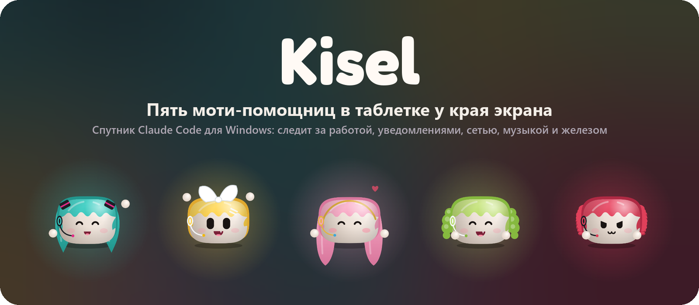
</p>

<p align="center">
  <a href="https://github.com/Tiutiunov/Kisel/releases/latest"></a>
  
  
  <a href="README.md"></a>
</p>

<h3 align="center">
  <a href="https://github.com/Tiutiunov/Kisel/releases/latest">Download for Windows</a>
</h3>

Kisel is a small dark bar at the edge of your screen with five mochi living in it. It started out with one job: show what [Claude Code](https://claude.com/claude-code) is up to without switching to the terminal, and let me answer its "may I run this?" with one click. Then a music player moved in, then notifications, a hardware monitor and a speed test, and now I just never close it.

There isn't a single image file inside. The characters, the icons, the sparkles and even the sounds are all made in code.

(A couple of the pictures below have Russian captions, sorry about that. The app itself is in English.)

## Who lives there

<p align="center">
  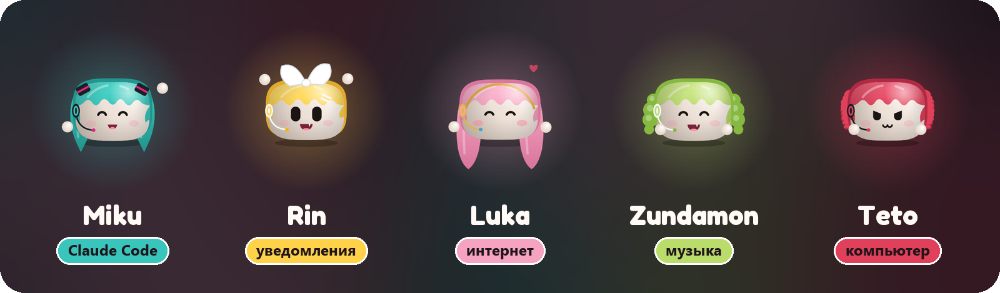
</p>

| | Her job | What she's like |
| --- | --- | --- |
| **Miku** | Claude Code: sessions, permissions, questions, chat | Earnest, hums to herself. Slap her and she sulks |
| **Rin** | Windows notifications: waves a sign with the app's name | Loud. Blows up when slapped |
| **Luka** | The connection: ping, speed, downloads, the speed test | Calm. A slap gets you a "really?" look |
| **Zundamon** | Music from Spotify | A show-off who panics first |
| **Teto** | CPU, GPU, memory | Smug, right up until you're nice to her |

You pick the main one by clicking the bench on the right. The others don't go anywhere: they sit there, blink, and pull faces now and then.

Who does what can be rearranged in Settings: Teto on Claude Code, Miku on the music, whatever you like. Character and favourite food stay with the mochi; the job moves.

## The bar

288 by 32 pixels, at home on any edge of the screen. What it shows depends on what's going on.

<p align="center">
  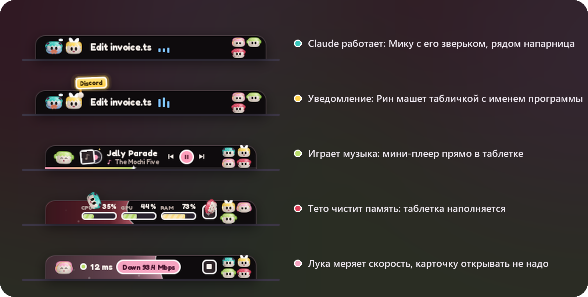
</p>

A few things that took longer than they should have:

- They somersault over the whole bar to get to the bench and back. Just vanishing would have been boring.
- While Claude works, Miku sits on the left holding its little orange creature, and someone keeps her company. They shove each other, toss a star around, play hide and seek, reach for the creature. There are forty-odd of these little scenes, and each of them has one of her own: Teto gets laughed at and raises her broom.
- The speed test and the memory clean start right from the bar, and while they run the bar fills up with liquid.
- If music is playing and there are at least two of them, a dance breaks out every so often.
- A minute of nothing and the bar slides off the edge. With music on it stays as a mini player, and you can scrub the track along its edge.
- Under a full-screen game it drops to the very bottom of the screen instead of hanging in the middle of the picture.
- To move it, hit the arrows button in the card's header: it comes off its edge, follows the pointer like jelly, and when you let go it flies to the nearest edge by itself. On a side edge it stands on end, with everything it has along the top or bottom.
- At start-up Miku comes up from the bottom of the screen and waves, and only then does the bar turn up for her to fly into.

<p align="center">
  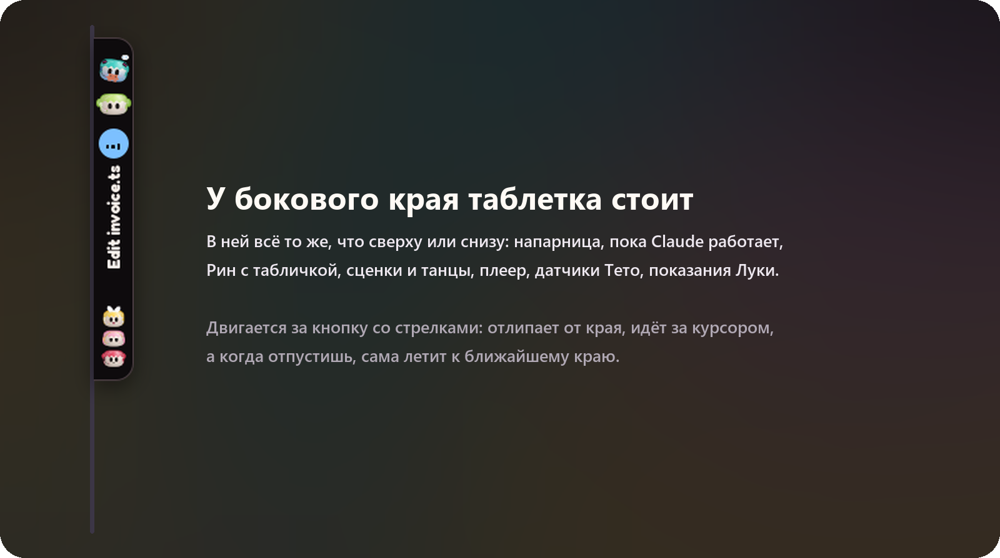
</p>

## The cards

Click the main character and the card opens. Each has her own.

<table>
  <tr>
    <td width="50%">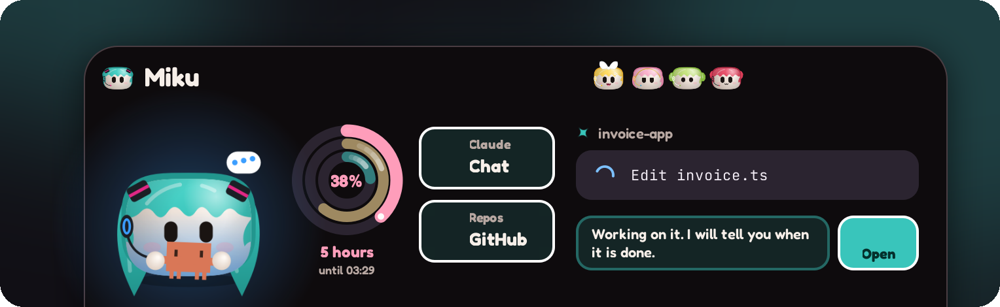<br><b>Miku.</b> What the latest session is doing, and three limit rings: the five hours, the week, and how full the context is. Underneath, when the limit resets.</td>
    <td width="50%">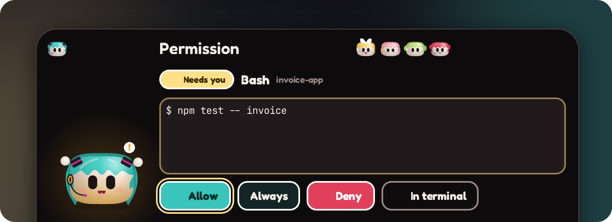<br><b>Permissions.</b> Claude wants to run or edit something and the card opens by itself. Kisel never answers for you. Only your click does.</td>
  </tr>
  <tr>
    <td>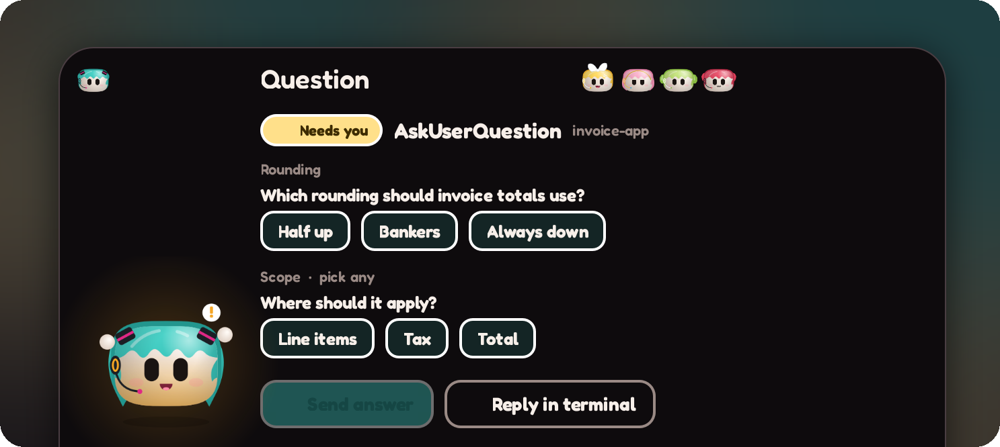<br><b>Questions.</b> The options as buttons; your answer goes back to Claude Code.</td>
    <td>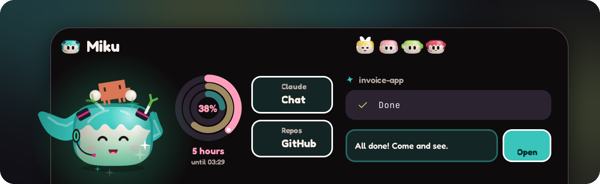<br><b>Done.</b> Miku celebrates with leeks flying around. Everyone has a favourite food.</td>
  </tr>
  <tr>
    <td>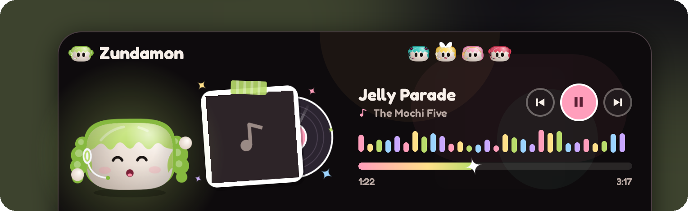<br><b>Zundamon.</b> Cover, title, buttons, seeking. It reads the system media session, so Spotify itself is left alone.</td>
    <td>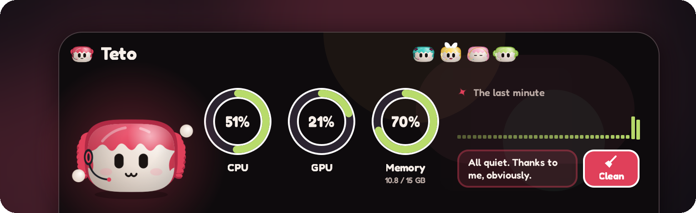<br><b>Teto.</b> The last minute of load and a button that cleans memory. She'll tell you how much she freed, and not modestly.</td>
  </tr>
  <tr>
    <td colspan="2">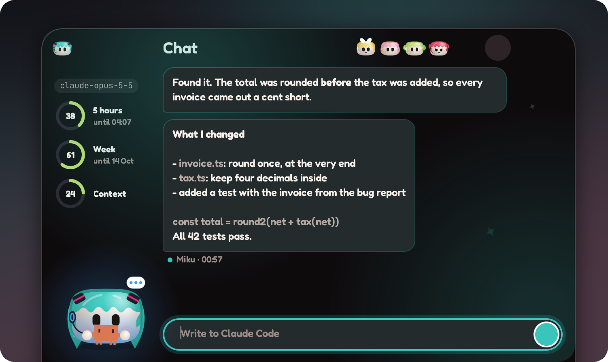<br><b>Chat.</b> You write here and it goes to your running Claude Code session as an ordinary prompt. The answers come back here, with your limits and the model on the left. No API key needed.</td>
  </tr>
  <tr>
    <td>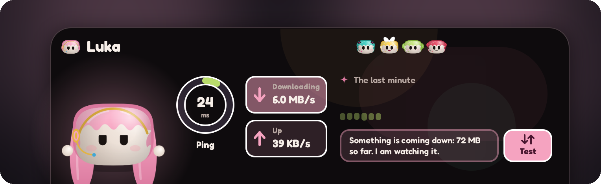<br><b>Luka.</b> Ping and current speed. The Test button measures the line without opening a speed test site. The faster it is, the happier she gets; a slow one upsets her.</td>
    <td>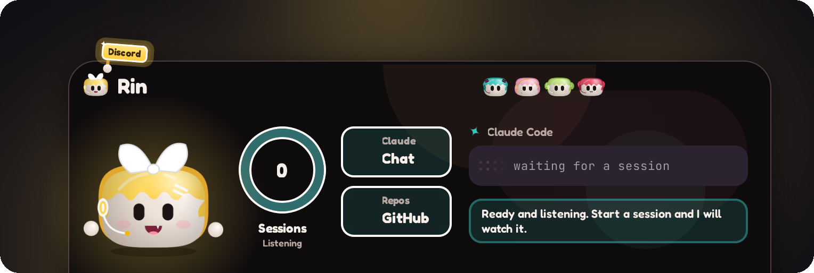<br><b>Rin.</b> Holds up a sign with the app's name until you look. Click her and that app opens. She's also the one who tells you about a new Kisel version.</td>
  </tr>
</table>

<p align="center">
  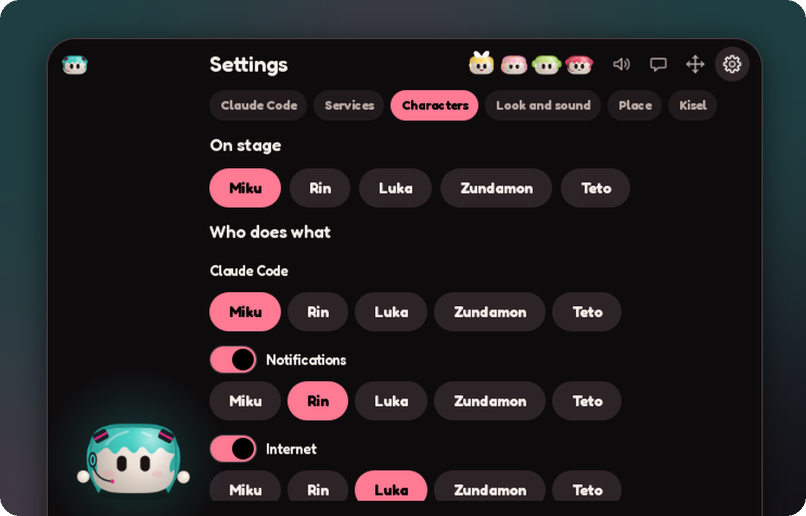
</p>

Settings are in tabs: Claude Code, services, characters, look and sound, place, Kisel itself.

You can play with all the animations and scenes separately: open [`design/miku-editor.html`](design/miku-editor.html) in a browser. It has sliders for how each of them looks, too.

## Installing

Grab `KiselSetup` from the [releases page](https://github.com/Tiutiunov/Kisel/releases/latest) and run it. It installs into your user profile, no admin rights needed. Windows 10 (1803+) or 11.

The installer isn't code-signed (certificates cost money), so SmartScreen will complain: "More info", then "Run anyway".

It updates itself. Once a day it asks GitHub whether anything new is out, and if so Rin holds up a sign with the version number. After that it's one button in Settings: download, checksum, install, restart. You can turn the check off there as well.

Uninstall from "Installed apps" in Windows settings. That also takes Kisel's hooks out of Claude Code's settings; your own settings stay.

The interface is English by default. Russian is in Settings if you want it.

## Hooking it up to Claude Code

Card → gear → **Connect Claude Code**. Kisel shows exactly what it will add to `~/.claude/settings.json` and doesn't touch the file until you click. It makes a backup first.

After that Claude Code calls a tiny `kisel-hook` on every event, which passes it on to Kisel. If Kisel isn't running, the hook exits quietly and Claude Code never notices. If the hooks go missing or stale after an update, Kisel tells you and offers to repair them.

### Mods: the chat and the limits

In the same place there is an **Install mods** button. It installs two Claude Code plugins that ship with Kisel:

- `kisel-prompts` joins a session to Kisel's chat: prompts in, answers and limits back.
- `cache-band` shows, above the prompt box in Claude Code, how many tokens sit in the cache.

Kisel runs Claude Code's own `claude plugin ...` commands for this and shows them first, so the `claude` command line has to be installed. The mods load in sessions started after that.

## Discord

If you want, Kisel shows "Working with Claude Code" with a timer in your Discord profile. It is off until you switch it on in Settings. The session's name is shown only if you switch that on too. It talks only to the Discord running on your computer.

## Your data

Secrets (a GitHub token for the widget) live in the Windows Credential Manager and are never written to files.

No telemetry. Kisel goes online for the GitHub widget, to ping `1.1.1.1` for Luka, to check for updates once a day, and to measure speed through Cloudflare when you press the button. All of it can be switched off or never starts by itself. The chat goes through your local Claude Code session, not through any network of Kisel's.

Point by point: [docs/PRIVACY.md](docs/PRIVACY.md). Terms of use: [docs/TERMS.md](docs/TERMS.md).

From notifications it reads the app's name and how many there are. Never the text.

Settings are in `%LOCALAPPDATA%\kisel\kisel.conf`, a plain text file.

## Building it yourself

**Windows.** Visual Studio 2022 with C++, CMake, Ninja and Qt 6.5+ for MSVC. From an "x64 Native Tools" prompt:

```powershell
cmake -S . -B build -G Ninja -DCMAKE_BUILD_TYPE=Release -DCMAKE_PREFIX_PATH=C:\Qt\6.10.3\msvc2022_64
cmake --build build
cmake --install build --prefix dist
dist\bin\kisel.exe
```

The installer: `cmake --build build --target installer`. A release is that file attached to a tag named `win-v<version>`.

**Linux (KDE Plasma 6).** This is where Kisel began, and the code for it is still here, but this branch has only been run on Windows lately. It needs `qtbase`, `qtdeclarative`, `qtsvg`, `qtwayland`, `layer-shell-qt`, `kwallet` and `kstatusnotifieritem`:

```bash
cmake -S . -B build -DCMAKE_BUILD_TYPE=Release
cmake --build build -j"$(nproc)"
ctest --test-dir build --output-on-failure
```

Handy while working on it:

```bash
kisel --demo                 # act out a fake Claude Code session with a permission request
kisel --demo --open settings # open straight on a view
kisel --intro                # play the first-launch animation
kisel --speed-test           # measure the connection, print the result, quit
kisel --check-updates        # ask GitHub for a newer version, print the answer, quit
KISEL_DEBUG=1 kisel          # print every hook event that arrives
```

Sounds are regenerated with `python scripts/gen_sounds.py`. How it all fits together is in [docs/ARCHITECTURE.md](docs/ARCHITECTURE.md).

| Path | What's there |
| --- | --- |
| `src/core` | The hub, the hook socket, the hook installer, chat, secrets, preferences, updater, speed test. No UI, unit-tested |
| `src/app` | The window, tray, monitors, and the Windows-side watchers (media, notifications, system, network) |
| `hook/` | `kisel-hook`, the relay Claude Code runs on every event |
| `qml/` | The mascots, the island, the views, the Russian strings (`Tr.qml`) |
| `packaging/windows` | The installer |
| `tests/` | Core tests |

## Where it came from

Kisel was started by Anton Kuklin as a companion for KDE Plasma. This branch is the Windows version, which has grown all the rest since. The characters' shape was borrowed from Coucou's Mochi.

## Licences and rights

The code is [MIT](LICENSE). That covers the code only.

The characters aren't mine. Kisel is a non-commercial fan project, not affiliated with or endorsed by their rights holders. Everything is drawn by Kisel's own code in its own style; nobody's artwork, voice or music is included.

- Hatsune Miku, Kagamine Rin, Megurine Luka © Crypton Future Media, INC. [www.piapro.net](https://www.piapro.net), under the [Piapro Character License](https://piapro.jp/license/pcl/summary).
- Kasane Teto © TWINDRILL, under the [character usage terms](https://kasaneteto.jp/guidelines/character.html).
- Zundamon © SSS LLC., under the [project's guidelines](https://zunko.jp/guideline.html).

> この作品はピアプロ・キャラクター・ライセンスに基づいてクリプトン・フューチャー・メディア株式会社のキャラクター「初音ミク」「鏡音リン」「巡音ルカ」を描いたものです。

Kisel has nothing to do with Anthropic. Claude and Claude Code are their trademarks, and the little orange creature Miku hugs while she works is their Claude Code character too.

It's built on [Qt 6](https://www.qt.io) under the LGPL v3, linked dynamically: the libraries sit next to `kisel.exe` untouched and you can swap in your own build. Qt's source is at [download.qt.io](https://download.qt.io/official_releases/qt/). The licence texts are installed into the `licenses` folder, and everything else is listed in [THIRD-PARTY-NOTICES.md](THIRD-PARTY-NOTICES.md).
